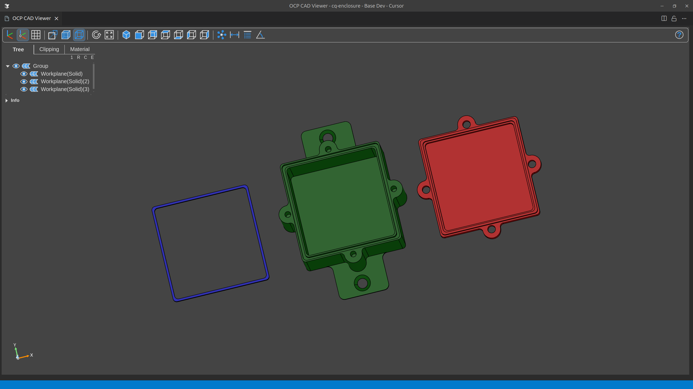

# CQ-Enclosure

A parametric IP66-rated enclosure generator for 3D printing, built with CadQuery. This package allows you to easily create customized enclosures with gaskets and various screw mounting options.

All components (box, lid, and gasket) can be exported as STEP files for compatibility with any CAD software and 3D printing workflow.

## Features

- Fully parametric enclosure generation
- IP66-rated design with gasket
- Multiple screw mounting options:
  - Inside or outside box mounting
  - Wood screw or machine screw support with countersunk head
  - Configurable corner and middle screw positions
- Mounting holders for attaching the enclosure
- Automatic generation of:
  - Main enclosure box
  - Matching lid
  - Gasket for water-tight seal

## Installation

Requires python 3.10 or higher.

```bash
pip install cq-enclosure
```

## Usage

See the [examples](examples/) directory for complete usage examples.

## Examples

```python
box, lid, gasket = Enclosure(
    box_inner_width=31.0,
    box_inner_length=71.0,
    box_inner_height=31.0,
    screw_location=ScrewLocation.INSIDE_BOX,
    middle_length_screws=True,
).build()
```


---

```python
box, lid, gasket = Enclosure(
    box_inner_width=31.0,
    box_inner_length=71.0,
    box_inner_height=31.0,
    screw_location=ScrewLocation.INSIDE_BOX,
    middle_length_screws=True,
    screw_type=ScrewType.WITH_SQUARE_NUT,
).build()
```


---

```python
box, lid, gasket = Enclosure(
    box_inner_width=31.0,
    box_inner_length=71.0,
    box_inner_height=31.0,
    screw_location=ScrewLocation.OUTSIDE_BOX,
    middle_width_screws=True,
    corner_screws=False,
    screw_type=ScrewType.WITH_SQUARE_NUT,
).build()
```


---

```python
box, lid, gasket = Enclosure(
    box_inner_width=31.0,
    box_inner_length=71.0,
    box_inner_height=31.0,
    screw_location=ScrewLocation.OUTSIDE_BOX,
    middle_length_screws=True,
    corner_screws=False,
    screw_type=ScrewType.WITH_SQUARE_NUT,
).build()
```


---

```python
box, lid, gasket = Enclosure(
    box_inner_width=50.0,
    box_inner_length=50.0,
    box_inner_height=40.0,
    screw_location=ScrewLocation.OUTSIDE_BOX,
    corner_screws=False,
    middle_width_screws=True,
    middle_length_screws=True,
    screw_type=ScrewType.WOOD_SCREW,
).build()
```


---

```python
box, lid, gasket = Enclosure(
    box_inner_width=50.0,
    box_inner_length=50.0,
    box_inner_height=40.0,
    screw_location=ScrewLocation.OUTSIDE_BOX,
    corner_screws=False,
    middle_width_screws=True,
    middle_length_screws=True,
    screw_type=ScrewType.WOOD_SCREW,
    mount_holders=False,
).build()
```


## Parameters

The `Enclosure` class accepts the following parameters:

### Core Dimensions
- `box_inner_width`: Internal width (X) of the enclosure
- `box_inner_length`: Internal length (Y) of the enclosure
- `box_inner_height`: Internal height (Z) of the enclosure
- `actual_inner_width`: Whether to include screw cylinder dimensions in box_inner_width when using inside box screws (default: True)
- `actual_inner_length`: Whether to include screw cylinder dimensions in box_inner_length when using inside box screws (default: True)

### Split to box and lid
- `cut_top`: Height at which the box splits into lid and base (default: 5.0mm)

### Screw Configuration
- `screw_location`: Location of mounting screws (`ScrewLocation.INSIDE_BOX` or `ScrewLocation.OUTSIDE_BOX`, default: OUTSIDE_BOX)
- `screw_type`: Type of screws to use (`ScrewType.WOOD_SCREW` or `ScrewType.WITH_SQUARE_NUT`, default: WOOD_SCREW)
- `screw_hole_diameter`: Diameter of the screw holes (default: 3.3mm including tolerance)
- `screw_head_diameter`: Diameter of the screw head (default: 6.0mm)
- `screw_total_length`: Total length of the screws (default: 16.0mm)
- `corner_screws`: Enable/disable corner mounting points (default: True)
- `middle_length_screws`: Enable/disable middle mounting points on length sides (default: False)
- `middle_width_screws`: Enable/disable middle mounting points on width sides (default: False)

### Square Nut Parameters
- `square_nut_width`: Width of square nuts (default: 5.5mm)
- `square_nut_height`: Height of square nuts (default: 1.8mm)
- `nut_wa_type`: Nut printing workaround type (`NutPrintingWA.CUT_RECT_SPACES` or `NutPrintingWA.ADD_CEILING`, default: ADD_CEILING)

### Gasket Parameters
- `gasket_height`: Height of the gasket (default: 1.6mm)
- `gasket_width`: Width of the gasket (default: 1.2mm)
- `gasket_spacing`: Spacing around the gasket (default: 0.15mm)
- `gasket_compression`: Compression factor for the gasket (default: 0.2mm)

### Mount Holders
- `mount_holders`: Enable/disable mounting holders (default: True)
- `mount_holder_length`: Length of mounting holders (default: 15.0mm)
- `mount_holders_screw_hole_diameter`: Diameter of mount holder screw holes (default: 5.0mm)
- `mount_holders_head_screw_diameter`: Diameter of mount holder screw heads (default: 9.0mm)
- `mount_holders_fillet`: Enable/disable fillets on mount holders (default: True)

### 3D Printing Parameters
- `layer_height`: Layer height for 3D printing, used for square nut printing trick (default: 0.28mm)

### Aesthetic Options
- `fillet_bottom`: Enable/disable bottom fillets (default: True)
- `fillet_top`: Enable/disable top fillets (default: True)

## Development

To set up a development environment:

1. Clone the repository
2. Install [astral uv](https://docs.astral.sh/uv/getting-started/installation/) package manager.
3. Create and initialize a virtual environment:
   ```bash
    uv sync
   ```

## License

MIT License

Copyright (c) 2025 Szymon Światczyński

Permission is hereby granted, free of charge, to any person obtaining a copy
of this software and associated documentation files (the "Software"), to deal
in the Software without restriction, including without limitation the rights
to use, copy, modify, merge, publish, distribute, sublicense, and/or sell
copies of the Software, and to permit persons to whom the Software is
furnished to do so, subject to the following conditions:

The above copyright notice and this permission notice shall be included in all
copies or substantial portions of the Software.

THE SOFTWARE IS PROVIDED "AS IS", WITHOUT WARRANTY OF ANY KIND, EXPRESS OR
IMPLIED, INCLUDING BUT NOT LIMITED TO THE WARRANTIES OF MERCHANTABILITY,
FITNESS FOR A PARTICULAR PURPOSE AND NONINFRINGEMENT. IN NO EVENT SHALL THE
AUTHORS OR COPYRIGHT HOLDERS BE LIABLE FOR ANY CLAIM, DAMAGES OR OTHER
LIABILITY, WHETHER IN AN ACTION OF CONTRACT, TORT OR OTHERWISE, ARISING FROM,
OUT OF OR IN CONNECTION WITH THE SOFTWARE OR THE USE OR OTHER DEALINGS IN THE
SOFTWARE.
